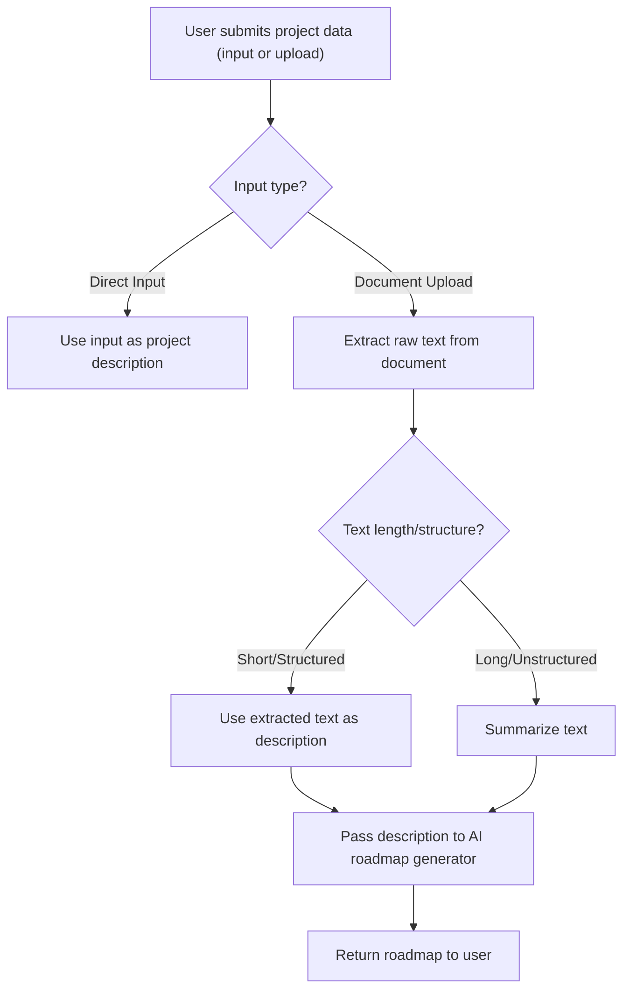
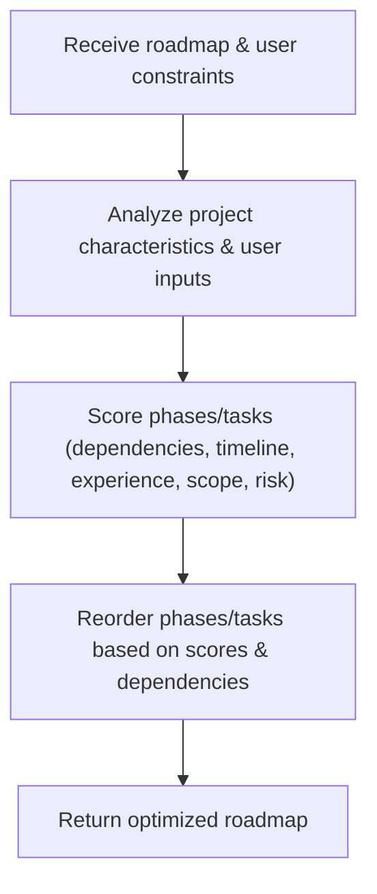
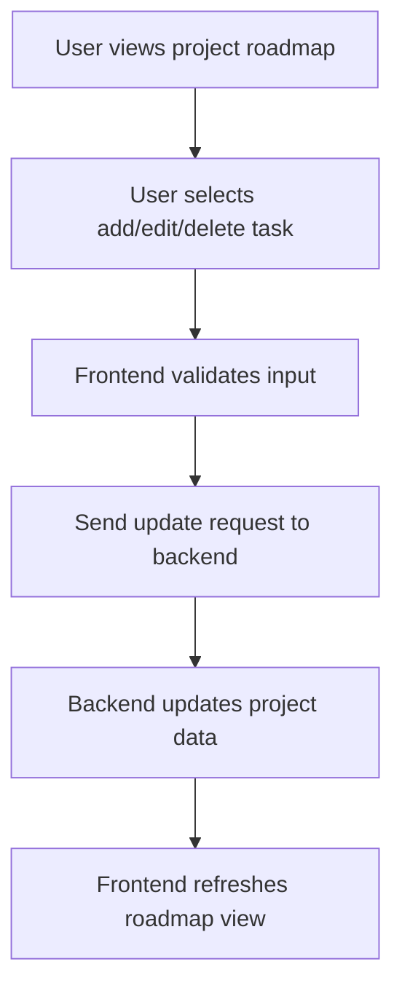
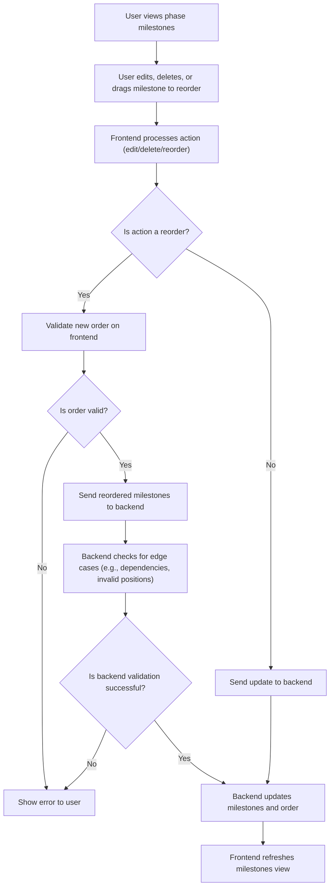
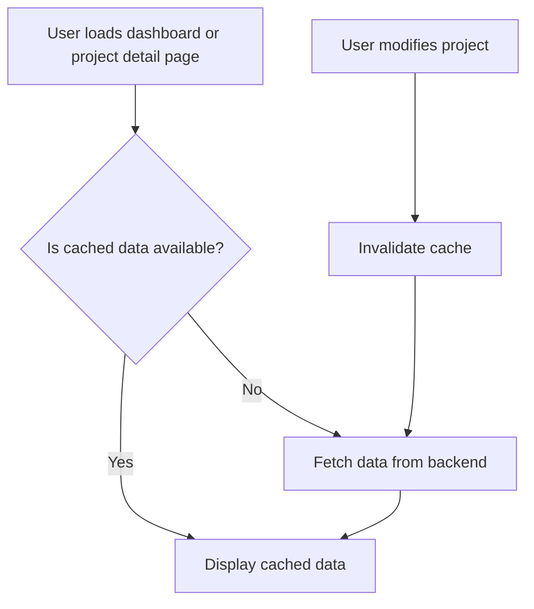

# Meta University Eng 2025 Project Readme

## Project Planner and Roadmap Generator

**Intern:** Solomon Agyire  
**Intern Manager:** Jessica Sun  
**Intern Director:** Zahra Surani  
**Peer(s):** Winston Lu, Shelly Fang  
**GitHub Repository Link:** [https://github.com/MetaU-Capstone-Solomon/project-planner](https://github.com/MetaU-Capstone-Solomon/project-planner)

---

## Overview

Project Planner and Roadmap Generator is a full-stack web application designed to help students, and developers turn their project ideas into actionable plans. By leveraging system and AI, the app generates custom, step-by-step roadmaps with timelines, technical tasks, and curated learning resources tailored to each user’s needs and experience level.

**Key features include:**
- AI-powered roadmap and task generation
- File upload and data import for flexible project input
- Progress tracking and milestone management
- Curated resources

**Category:** Productivity

---

## Story

As someone who has experienced the frustration of having a great project idea but struggling to bring it to life, I know how easy it is to lose momentum when faced with roadblocks and uncertainty. Whether you’re a student, a developer, or a hobbyist, turning ideas into reality requires structure, resources, and clear planning. Project Planner and Roadmap Generator was created to help anyone overcome these obstacles—by providing a guided, step-by-step approach to project planning, progress tracking, and resource discovery.

---

## Market

- **Target:** Engineering students and Developers

---

## Habit

We anticipate that students and developers will use the app:
- **Daily or every other day:** To track progress, update tasks, and access resources
- **Weekly:** To review project timelines, adjust plans, and set new goals
- **Monthly:** To reflect on progress and identify areas for improvement

---

## Scope

The initial scope of Project Planner and Roadmap Generator will cover project planning and management tools specifically designed for students and developers, including features to help them create, organize, and track their projects. This will include project idea generation, task creation, timeline, resource allocation, and progress monitoring.

> **Note:** It is strictly going to be a roadmap and resource planning and guide. Something that will be out of scope will be brainstorming ideas from it.

---

## Product Spec

Basically, a student or a developer signs up for our app and inputs their project idea, goals, requirements, and experience level. The app generates a custom, step-by-step roadmap with timelines, technical tasks, and curated learning resources tailored to the student's needs. The student uses the roadmap to guide their project development, marking tasks as completed and tracking their progress along the way. As they work on their project, they can access additional resources and support through our app, such as tutorials and documentation. By providing a structured approach to project planning and execution, the app helps students to bring their ideas to life and develop valuable skills in project management, time management, and problem-solving.

---

## User Roles

- **Student:** A user who is creating and managing projects to achieve their academic or personal goals.
- **Developer:** A user (professional) who is planning, organizing, and tracking technical projects for work, learning, or personal development.

---

## User Stories

- As a developer, I want to generate a project plan from my ideas, so that I can focus on my project and get it done.
- As a developer, I want to add tasks to my project plan, so that I can break down my work into manageable chunks.
- As a developer, I want to set deadlines for my tasks, so that I can stay on track and meet my goals.
- As a developer, I want to view my project timeline, so that I can see my progress and upcoming deadlines.
- As a developer, I want to access resources and tutorials related to my project, so that I can learn new skills and get help when I need it.
- As a developer, I want to track my progress and reflect on my learning or development, so that I can identify areas for improvement.
- As a developer, I want to receive reminders and notifications about upcoming deadlines, so that I can stay on track and avoid last-minute cramming or missed deliverables.
- As a developer, I want to be able to login into the app, so that I can view and manage my project plan securely.
- As a developer, I want to be able to export my project plan in different formats, so that I can use it in other tools and platforms.
- As a developer, I want to be able to customize my project plan to fit my needs and preferences, so that I can make it my own.

---

## Requirements

### Required
- User can login
- User can create an account
- User can see their profile
- User can send inputs to our AI
- User can view response from AI
- User can add or modify inputs
- User can save response
- Users can track their progress

### Optional
- User can get reminders of deadlines
- User can edit their profile information
- Users can delete project

---

## User Personas

**Persona 1: Diana Lee**
- **Age:** 18
- **Location:** College campus
- **Technology access:** Laptop and phone, primary access through laptop
- **Motivation:** Diana is a freshman in college, eager to succeed in her first computer science class. She has multiple projects to complete but is unsure about how to approach them.
- **Pain points:** Diana lacks experience with project management and needs guidance on how to plan and execute her projects.

**Persona 2: John Fu**
- **Age:** 19
- **Location:** New York
- **Technology access:** Laptop and phone
- **Motivation:** John is a student software engineer who wants to land his first technical internship. He has an idea for a project but doesn't know where to start or what resources to use.
- **Pain points:** John struggles with planning and implementing his project according to his timeline. He needs help finding the right resources and staying on track.

**Persona 3: Vivian Kong**
- **Age:** 20
- **Location:** Huntsville
- **Technology access:** Laptop and phone
- **Motivation:** Vivian has an idea and started building it, but hit a roadblock and doesn't know how to proceed. She needs help replanning her approach and finding ways to resolve the issue.
- **Pain points:** Vivian is frustrated with being stuck and doesn't know where to turn for help. She needs guidance on how to overcome the obstacle and finish her project.

---

## Technical Challenges

### Technical Challenge #1 - Document Upload, Input Handling, and Text Summarization
**What:**
- Enabling users to input project data from various sources, including direct text input and document uploads (such as PDFs or text files). The challenge was to process and extract relevant information from these diverse formats and summarize lengthy content into concise, actionable project descriptions. This goes beyond standard form handling and requires file parsing and natural language processing techniques.

**How:**
- The backend implements a file processing service that accepts uploaded documents, detects their type, and extracts raw text content. For large or unstructured documents, a text summarization module uses keyword extraction and sentence ranking algorithms to condense the content into a focused project summary. This summary is then used as input for the AI-powered roadmap generation. The flow ensures that users can start with minimal manual effort, regardless of their input format, and still receive a high-quality, tailored project plan. Technologies involved include file parsing libraries, custom keyword-based summarization logic, and integration with the AI roadmap generation pipeline.

[Read the full technical documentation on text summarization here.](https://docs.google.com/document/d/1ASMo3flmZ7QqbIYGOMxCxO-qNuVpQD6KfXut4UkBpa4/edit?tab=t.0#heading=h.1frspbya81y)

### Technical Challenge #2 - Roadmap Prioritization Algorithm
**What:**
- Automatically prioritizing and sequencing project phases and tasks based on user constraints (such as timeline, experience level, and project scope). The challenge was to design an adaptive algorithm that intelligently reorders tasks and phases for optimal learning and project efficiency, rather than relying on static or manual ordering. This goes beyond basic sorting or if-else logic and requires multi-factor decision-making.

**How:**
- The backend implements a weighted scoring algorithm that analyzes project characteristics and user inputs. Each phase and task is scored based on factors like logical dependencies, timeline fit, user experience, project scope, and risk assessment. The algorithm then reorders phases and tasks to maximize learning progression and project success, while preserving critical dependencies. The system adapts to different project types (MVP, full-featured, enterprise) and user skill levels, ensuring a personalized and efficient roadmap for every user. Technologies involved include custom scoring utilities, configuration-driven weights, and dependency validation logic.

[Read the full technical documentation on roadmap prioritization here.](https://docs.google.com/document/d/1B9r1jldq8rVe78MBW-8oKfpAzeRJ9flpJGUBKGOPv7M/edit?tab=t.0#heading=h.6ncgqme60l4g)

---

## Stretch Goals

### Stretch Goal #1 - Editable Tasks (Create, Edit, Delete)
**What:**
- Allow users to fully manage their project tasks, including creating new tasks, editing existing ones, and deleting tasks as needed. This gives users complete control over the structure and content of their project roadmap.

**How:**
- The frontend provides UI controls for adding, editing, and deleting tasks within each milestone. When a user performs an action, the change is validated and sent to the backend, which updates the project data accordingly. The UI then refreshes to reflect the latest state, ensuring a seamless editing experience.

TODO: Add documentation link here.

### Stretch Goal #2 - Milestone Edit, Delete, and Reordering
**What:**
- Enable users to edit milestone details, delete milestones, and reorder milestones within a phase. This empowers users to customize the structure and flow of their project roadmap to match their evolving needs.

**How:**
- The frontend allows users to open a modal to edit milestone details, provides controls to delete milestones, and supports drag-and-drop reordering. When a user reorders milestones, the new order is validated on the frontend to prevent invalid states (such as duplicate or missing order numbers). The backend receives the updated order, checks for edge cases (e.g., circular dependencies, invalid milestone positions), and updates the roadmap data accordingly. If the reordering is valid, the backend persists the new order and returns the updated roadmap. The UI updates in real time to reflect the new milestone order and content, and users are notified if an invalid operation is attempted.

TODO: Add documentation link here.

### Stretch Goal #3 - Caching Implementation for Dashboard and Project Detail
**What:**
- Implement caching for dashboard and project detail pages to improve performance and reduce unnecessary backend calls. Cached data is used for fast reloads, and only refreshed from the backend when a project is modified.

**How:**
- The frontend uses a caching layer (such as React Query) to store project and dashboard data locally. On page load, the app first checks the cache; if data is present and not stale, it displays the cached data. If a project is modified, the cache is invalidated and fresh data is fetched from the backend. This ensures both speed and data consistency.

TODO: Add documentation link here.
