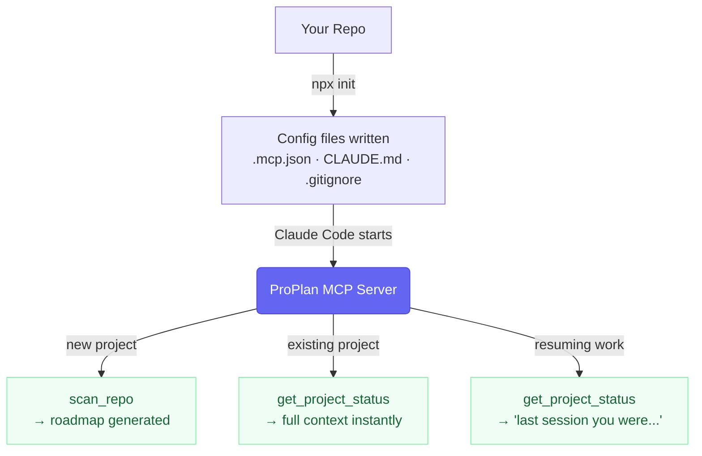

<div align="center">

<a href="https://modelcontextprotocol.io"></a>

# ProPlan

**Your project roadmap lives inside Claude.**

It tracks progress, knows your codebase, and resumes exactly where you left off — every single session.

[](https://www.npmjs.com/package/@proplandev/mcp)
[](LICENSE)
[](mcp-server/tests)
[](https://nodejs.org)
[](https://modelcontextprotocol.io)

[Quick Start](#quick-start) · [How It Works](#how-it-works) · [Dashboard](#dashboard) · [Tools](#tools) · [Manual Setup](#manual-setup)

</div>

---

## The Problem

Every time you open Claude Code, it's a blank slate. You re-explain the project. You re-describe what's done. You remind it what's next.

ProPlan fixes this with one word:

```
You: continue

Claude: I see we were working on the auth middleware. Last session you finished
        JWT validation but left the refresh token logic incomplete. 3 tasks are
        in progress across Phase 2. Want to pick up from there?
```

> **One word. Full context. Every session.**

---

## What Makes ProPlan Different

There are memory tools for Claude. There are project management tools like Linear and Jira. **ProPlan is the only one that does both — inside Claude's tool context.**

|  | Linear / Jira / Notion | Claude's built-in memory | **ProPlan** |
|--|--|--|--|
| Visual dashboard | ✅ | ❌ | ✅ |
| Lives inside Claude | ❌ | ✅ | ✅ |
| Structured roadmap | ✅ | ❌ | ✅ |
| Reads your codebase | ❌ | ❌ | ✅ |
| Claude updates it | ❌ | ❌ | ✅ |
| Syncs across machines | ✅ | ❌ | ✅ |

---

## Quick Start

```bash
npx @proplandev/mcp@latest init
```

That's it. The setup wizard will:

1. Ask **local** (SQLite, zero config) or **cloud** (syncs to the web dashboard)
2. Write your `.mcp.json` automatically
3. Create a `CLAUDE.md` so Claude knows to call `get_project_status` on every session start
4. Update `.gitignore` so your data isn't accidentally committed
5. Optionally update your Claude settings to skip approval prompts for read-only tools

Then restart Claude Code and type `start`.

---

## How It Works

### The Flow


```mermaid
flowchart TD
    A["Your Repo"] -->|npx init| B["Config files written<br/>.mcp.json · CLAUDE.md · .gitignore"]
    B -->|Claude Code starts| C(ProPlan MCP Server)
    C -->|new project| D["scan_repo<br/>→ roadmap generated"]
    C -->|existing project| E["get_project_status<br/>→ full context instantly"]
    C -->|resuming work| F["get_project_status<br/>→ 'last session you were...'"]

    classDef server fill:#6366f1,stroke:#4f46e5,color:#ffffff
    classDef outcome fill:#f0fdf4,stroke:#86efac,color:#166534
    class C server
    class D,E,F outcome
```

### Session Lifecycle

**Session Start** — `get_project_status(include_handoff: true)`
- `projectGoal` — your north-star goal for the project
- `lastSession` — summary of what was done last time
- `recentTasks` — tasks worked on recently
- `tech_metadata` — codebase structure and stack

**During Work** — after each task
- `update_task_status` — mark progress with a short note (required)
- `add_note_to_task` — log observations without changing status

**Session End** — `add_session_summary`
- What was worked on
- Decisions made
- What comes next

### Roadmap Structure

```
Project
└── Phase 1: Foundation
    ├── Milestone 1.1: Auth System
    │   ├── Task: Set up JWT ✓ completed
    │   ├── Task: Refresh tokens ◷ in_progress
    │   └── Task: Rate limiting ○ pending
    └── Milestone 1.2: Database
        └── ...
└── Phase 2: Features
    └── ...
```

---

## Dashboard

ProPlan includes a web dashboard at [project-planner-7zw4.onrender.com](https://project-planner-7zw4.onrender.com) where you can:

- **See all your projects** and their completion percentage
- **Track phases and tasks** visually outside of Claude
- **Generate your MCP token** for cloud sync
- **Share progress** with teammates or stakeholders

### Local → Dashboard

1. Run `npx @proplandev/mcp@latest init` → choose **local**
2. Use Claude to build your project — `create_project`, update tasks as you go
3. Run `export_to_cloud` with your MCP token from the dashboard Settings
4. View your projects at [project-planner-7zw4.onrender.com](https://project-planner-7zw4.onrender.com)

### Dashboard → Local

1. Sign up at [project-planner-7zw4.onrender.com](https://project-planner-7zw4.onrender.com)
2. Go to **Settings → Claude Code Integration** → generate an MCP token
3. Run `npx @proplandev/mcp@latest init` → choose **cloud** → paste your token
4. Open Claude Code — your projects sync automatically on every session start

---

## Tools

### Read Tools *(auto-approvable)*

| Tool | What it does |
|------|-------------|
| `get_project_status` | Status for one or all projects. Pass `include_handoff: true` for full session resume context in one call. |
| `get_project_roadmap` | Full roadmap. `summary_only: true` for a lightweight view. |
| `get_next_tasks` | Next pending or in-progress tasks ordered by phase → milestone. |
| `get_tasks` | Filter by status, phase, or keyword. Up to 500 results. |
| `scan_repo` | Directory tree + structural code analysis. Persists tech metadata when `project_id` provided. Hash-cached. |

### Write Tools *(approval required)*

| Tool | What it does |
|------|-------------|
| `create_project` | Create a project with full phase/milestone/task structure. |
| `update_task_status` | Update status with a required note (max 150 chars). |
| `add_note_to_task` | Append a note without changing status. |
| `add_task` / `add_milestone` / `add_phase` | Add items to the roadmap. All support `dry_run`. |
| `edit_task` / `edit_milestone` / `edit_phase` | Rename or update. All support `dry_run`. |
| `delete_task` / `delete_milestone` / `delete_phase` / `delete_project` | Delete items. All support `dry_run`. |
| `rename_project` | Rename a project. |
| `set_project_goal` | Set the permanent north-star goal shown on every session start. |
| `add_session_summary` | Save what was done this session. Capped at 10 — oldest dropped automatically. |
| `export_to_cloud` | Sync local SQLite projects to the web dashboard. |

---

## Skip Approval Prompts

The `init` wizard offers to do this automatically. If you skipped it, add this to `~/.claude/settings.json`:

```json
{
  "allowedTools": [
    "mcp__project-planner__get_project_status",
    "mcp__project-planner__get_next_tasks",
    "mcp__project-planner__get_project_roadmap",
    "mcp__project-planner__get_tasks",
    "mcp__project-planner__add_session_summary",
    "mcp__project-planner__update_task_status",
    "mcp__project-planner__add_note_to_task"
  ]
}
```

---

## Manual Setup

Prefer to edit `.mcp.json` yourself?

**Local mode** (SQLite — recommended to start)

```json
{
  "mcpServers": {
    "project-planner": {
      "command": "npx",
      "args": ["-y", "@proplandev/mcp"]
    }
  }
}
```

Data lives in `.project-planner/db.sqlite` in your project. Nothing leaves your machine.

**Cloud mode** (syncs to the web dashboard)

```json
{
  "mcpServers": {
    "project-planner": {
      "command": "npx",
      "args": ["-y", "@proplandev/mcp"],
      "env": {
        "MCP_TOKEN": "your-mcp-token"
      }
    }
  }
}
```

Get your `MCP_TOKEN` from [the dashboard Settings page](https://project-planner-7zw4.onrender.com/settings).

---

## Project Structure

```
mcp-server/
├── cli.js                  # Entry point — routes init vs MCP server
├── index.js                # MCP server — all tool registrations
├── bin/
│   └── init.js             # Interactive setup wizard
├── adapters/
│   ├── SqliteAdapter.js    # Local SQLite storage
│   └── BackendApiAdapter.js# Cloud API storage
├── tools/                  # One file per MCP tool (24 tools)
├── lib/
│   └── fileAnalyzer.js     # Structural code analyzer (JS/TS/Python/Go/Rust)
└── tests/                  # Jest test suite — 199 tests
```

---

## Requirements

- Node.js 18+
- Claude Code (or any MCP-compatible client)
- For cloud mode: a free account at [project-planner-7zw4.onrender.com](https://project-planner-7zw4.onrender.com)

---

## License

[Elastic License 2.0 (ELv2)](LICENSE) · Built by [Solomon Agyire](https://github.com/King-Proplan)
